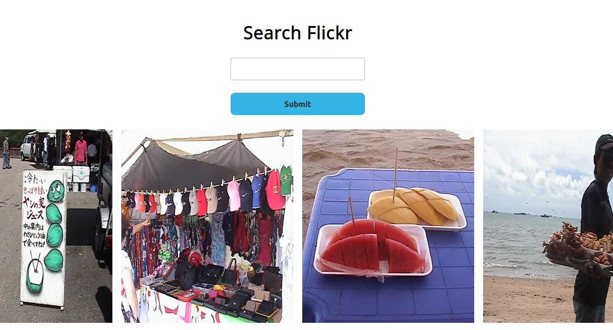

# Ruby on Rails Flickr Photostream!

> An API Based Web Application Written for the Odin Project

<div align='center'>
  
</div>

## Demo

[View The Live Demo](https://rails-flickr-photostream.herokuapp.com)

## Features

Look up a Flickr user to see their photostream!

## Deploy the Project

__Clone the repo to your local machine using the terminal__:
```
$ git clone git@github.com:andrewbaldwin44/Rails_Flickr_Stream.git
```

__Deploy the Development Server__:
1. Navigate into the project directory: `cd Rails_Flickr_Stream`
2. Install the dependencies: `bundle install`
3. Start the development server: `rails s`

This will run the app in the development mode.<br />
Open [http://localhost:3000](http://localhost:3000) to view it in the browser.

## Technologies Used

- Ruby
- Ruby On Rails
- SASS
- Flickr API

## Author

👤 **Andrew Baldwin**

- Github: [@andrewbaldwin44](https://github.com/andrewbaldwin44)
